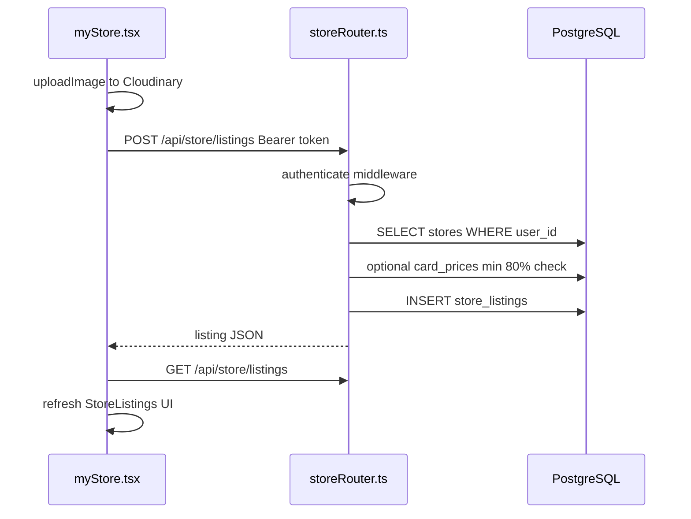
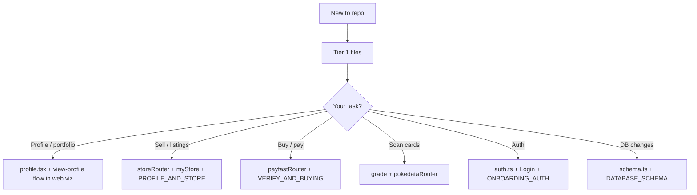

# FASAPlayer — What to Read First & How Files Are Organized

Onboarding guide for the monorepo: **Expo app** (`app/`) + **Express server** (`server/`). Use this before diving into domain-specific `.md` files at the repo root.

**Interactive map:** run the dev visualizer in [`web/`](web/) (`pnpm dev` → http://localhost:5173) — layered architecture & data flows from [`web/data/architecture.json`](web/data/architecture.json).

---

## System at a glance

```mermaid
flowchart LR
  subgraph docs [Docs - read first]
    QS[QUICK_START]
    ARCH[ARCHITECTURE]
    DS[DATABASE_SCHEMA]
  end
  subgraph appLayer [app - UI]
    AppTsx[App.tsx]
    Nav[RootNavigator + main.tsx]
    Screens[screens/]
    Comps[components/]
    ApiUrl[utils/apiBaseUrl.ts]
    AuthClient[lib/auth-client.ts]
  end
  subgraph serverLayer [server - API + DB]
    Index[index.ts]
    StoreR[storeRouter.ts]
    PayR[payfastRouter.ts]
    Schema[db/schema.ts]
    Auth[auth/auth.ts]
  end
  docs --> appLayer
  docs --> serverLayer
  appLayer -->|fetch /api/*| serverLayer
  serverLayer -->|Drizzle| DB[(PostgreSQL)]
```

---

## Tier 1 — Read these first (30–60 min)

| Priority | File | Why |
|----------|------|-----|
| 1 | [QUICK_START.md](QUICK_START.md) | Env vars, ports (app ~8081, server **3050**), setup order |
| 2 | [ARCHITECTURE.md](ARCHITECTURE.md) | End-to-end flow. **Stale sections:** “no database” / “no Better Auth” — both exist in code now |
| 3 | [server/src/index.ts](server/src/index.ts) | All mounted routers; Better Auth **before** `express.json()` |
| 4 | [app/App.tsx](app/App.tsx) | Providers, fonts, `AuthProvider`, navigation shell |
| 5 | [app/src/navigation/RootNavigator.tsx](app/src/navigation/RootNavigator.tsx) | Onboarding → Login → Main (with session re-check) |
| 6 | [app/src/main.tsx](app/src/main.tsx) | Bottom tabs + nested stacks |
| 7 | [app/src/utils/apiBaseUrl.ts](app/src/utils/apiBaseUrl.ts) | Backend URL; rewrites `localhost` → LAN IP on device |
| 8 | [app/src/lib/auth-client.ts](app/src/lib/auth-client.ts) | Better Auth + Expo SecureStore |

### Tier 1 takeaways (from code)

**Server boot** ([`server/src/index.ts`](server/src/index.ts)):

- CORS with `credentials: true` for auth cookies
- `app.all('/api/auth/*', toNodeHandler(auth))` before body parsers
- Routers: `/chat`, `/images`, `/files`, `/pokedata`, `/payment`, legacy `authRouter`, then **`storeRouter`** on `/`
- Listens on `0.0.0.0:3050`; runs `testConnection()` if `DATABASE_URL` is set

**App navigation** ([`app/src/navigation/RootNavigator.tsx`](app/src/navigation/RootNavigator.tsx)):

1. `!hasSeenOnboarding` → Onboarding only  
2. `!isAuthenticated` → Login only  
3. Else → `MainWithAuthCheck` (verifies `authClient.getSession()` before rendering tabs)

**Tabs** ([`app/src/main.tsx`](app/src/main.tsx)): Shop | Search | Grade | Profile | My Store — each tab (except Grade) has its own native stack.

**API base URL**: [`getApiBaseUrl()`](app/src/utils/apiBaseUrl.ts) reads `EXPO_PUBLIC_ENV`, `EXPO_PUBLIC_DEV_API_URL`, `EXPO_PUBLIC_BACKEND_URL`. Most screens use [`DOMAIN`](app/constants.ts) which is `getApiBaseUrl()`.

**Auth client**: [`authClient`](app/src/lib/auth-client.ts) uses same base URL + `expoClient` plugin (`saplayer://` scheme).

---

## Tier 2 — Core product domains

Pick **one** domain when you start feature work.

### Auth & onboarding

| Layer | Files |
|-------|--------|
| Docs | [ONBOARDING_AUTH_SETUP.md](ONBOARDING_AUTH_SETUP.md), [BETTER_AUTH_EXPO_SETUP.md](BETTER_AUTH_EXPO_SETUP.md), [DATABASE_AND_AUTH.md](DATABASE_AND_AUTH.md) |
| Server | [server/src/auth/auth.ts](server/src/auth/auth.ts), [server/src/auth/authRouter.ts](server/src/auth/authRouter.ts) (legacy) |
| App | [app/src/screens/auth/Login.tsx](app/src/screens/auth/Login.tsx), [app/src/screens/onboarding/](app/src/screens/onboarding/), [app/src/context/AuthContext.tsx](app/src/context/AuthContext.tsx) |

### Store, profile, marketplace (largest surface) — **recommended second read**

| Layer | Files |
|-------|--------|
| Docs | [PROFILE_AND_STORE_SYSTEMS.md](PROFILE_AND_STORE_SYSTEMS.md), [PRODUCT_PATHWAY.md](PRODUCT_PATHWAY.md), [app/MY_STORE_DESIGN.md](app/MY_STORE_DESIGN.md) |
| Server | **[server/src/store/storeRouter.ts](server/src/store/storeRouter.ts)** (~1.9k lines) |
| App | [app/src/screens/myStore.tsx](app/src/screens/myStore.tsx), [profile.tsx](app/src/screens/profile.tsx), [shop.tsx](app/src/screens/shop.tsx), [components/store/](app/src/components/store/), [components/profile/](app/src/components/profile/) |

**Domain rules** ([PROFILE_AND_STORE_SYSTEMS.md](PROFILE_AND_STORE_SYSTEMS.md)):

- **Profile** = portfolio; market value from `card_prices` (API → DB, 48h cache)
- **Store** = only place users set **listing price** (asking price in ZAR)

### Payments & verification

| Layer | Files |
|-------|--------|
| Docs | [VERIFY_AND_BUYING_SYSTEM.md](VERIFY_AND_BUYING_SYSTEM.md), [PAYMENT_AND_CARD_TRANSFER_FLOW.md](PAYMENT_AND_CARD_TRANSFER_FLOW.md), [server/PAYFAST_ITN_EXPLAINED.md](server/PAYFAST_ITN_EXPLAINED.md) |
| Server | [server/src/payment/payfastRouter.ts](server/src/payment/payfastRouter.ts) |
| App | [app/src/components/payment/PayFastPayment.tsx](app/src/components/payment/PayFastPayment.tsx) |

### Cards, grading, pricing (Pokedata)

| Layer | Files |
|-------|--------|
| Docs | [server/src/pokedata/CARD_MODULE_APIS_AND_TABLES.md](server/src/pokedata/CARD_MODULE_APIS_AND_TABLES.md), [CARD_PRICES_AND_IMAGES.md](CARD_PRICES_AND_IMAGES.md) |
| Server | [server/src/pokedata/pokedataRouter.ts](server/src/pokedata/pokedataRouter.ts) |
| App | [grade.tsx](app/src/screens/grade.tsx), [search.tsx](app/src/screens/search.tsx), [product.tsx](app/src/screens/product.tsx) |

### Database

| Layer | Files |
|-------|--------|
| Docs | [DATABASE_SCHEMA.md](DATABASE_SCHEMA.md), [server/DATABASE_SETUP.md](server/DATABASE_SETUP.md) |
| Code | **[server/src/db/schema.ts](server/src/db/schema.ts)**, [drizzle.ts](server/src/db/drizzle.ts), [migrations/](server/src/db/migrations/) |

### Legacy (RN-AI template)

| Layer | Files |
|-------|--------|
| Server | [chatRouter.ts](server/src/chat/chatRouter.ts), [imagesRouter.ts](server/src/images/imagesRouter.ts), [fileRouter.ts](server/src/files/fileRouter.ts) |
| App | [constants.ts](app/constants.ts) (LLM models), [context.tsx](app/src/context.tsx), [images.tsx](app/src/screens/images.tsx) (not wired in nav) |

---

## Tier 3 — UI building blocks

| Category | Location |
|----------|----------|
| Themes | [app/src/theme.ts](app/src/theme.ts), [app/DESIGN_SYSTEM.md](app/DESIGN_SYSTEM.md) |
| Primitives | [app/src/components/ui/](app/src/components/ui/) |
| Layout | [app/src/components/layout/](app/src/components/layout/) |
| Shop chrome | [app/src/components/shop/](app/src/components/shop/) |
| Conventions | [app/REUSABLE_COMPONENTS.md](app/REUSABLE_COMPONENTS.md) |

**Navigation:** React Navigation (not Expo Router). Screens: [app/src/screens/](app/src/screens/).

**API pattern:** No `src/api/` module — grep `fetch(` and `/api/` under `app/src`. Auth: `Authorization: Bearer` + `credentials: 'include'`.

---

## Tier 4 — Ops & troubleshooting

| Topic | Docs |
|-------|------|
| Ngrok / LAN | [NGROK_AND_HOSTING_SETUP.md](NGROK_AND_HOSTING_SETUP.md), [server/NGROK_SETUP.md](server/NGROK_SETUP.md) |
| Expo deploy | [EXPO_DEPLOYMENT.md](EXPO_DEPLOYMENT.md) |
| Submodules | [SUBMODULES_WORKFLOW.md](SUBMODULES_WORKFLOW.md) |
| PayFast | [server/PAYFAST_SETUP.md](server/PAYFAST_SETUP.md), [app/PAYFAST_INTEGRATION.md](app/PAYFAST_INTEGRATION.md) |

---

## Server routes — quick reference

Mounted in [server/src/index.ts](server/src/index.ts):

| Prefix | Router | Responsibilities |
|--------|--------|------------------|
| `/api/auth/*` | Better Auth | Sign-in, sessions, Expo |
| `/api/*` | [storeRouter.ts](server/src/store/storeRouter.ts) | Store, profile, listings, orders, PUDO, verification |
| `/payment/*` | [payfastRouter.ts](server/src/payment/payfastRouter.ts) | Checkout, ITN |
| `/pokedata/*` | [pokedataRouter.ts](server/src/pokedata/pokedataRouter.ts) | Recognize, grade, search, pricing |
| `/chat/*`, `/images/*`, `/files/*` | Legacy / uploads |

**Auth:** `authenticate` in `storeRouter.ts` — Better Auth session → Bearer token → legacy body/query token.

---

## Database tables — by domain

Source: [server/src/db/schema.ts](server/src/db/schema.ts). Columns: [DATABASE_SCHEMA.md](DATABASE_SCHEMA.md).

| Domain | Tables |
|--------|--------|
| Auth | `users`, `sessions`, `accounts`, `verification_tokens` |
| Inventory | `collections` |
| Marketplace | `stores`, `store_listings`, `listing_bids`, `orders`, `auctions`, `iso_items`, `store_reviews`, `followers` |
| Vault / verify | `vaulted_requests`, `verification_orders`, `verification_order_items` |
| Pricing cache | `card_prices`, `card_price_history`, `pokedata_search_cache` |

---

## End-to-end flow: Create a store listing

Worked example tracing **My Store → POST listing → DB row**.

### 1. UI — My Store tab

**Screen:** [app/src/screens/myStore.tsx](app/src/screens/myStore.tsx) (tab stack in [main.tsx](app/src/main.tsx))

**Base URL:** `DOMAIN` from [app/constants.ts](app/constants.ts) → `getApiBaseUrl()`

**Create listing** (~lines 560–613):

- Uploads card photos via `uploadImage()` → Cloudinary
- `POST ${DOMAIN}/api/store/listings` with `Authorization: Bearer ${token}`
- Body: `cardName`, `price`, `cardImage`, optional `cardImageBack`, `cardImageClose`
- On success: `fetchListings()` refreshes the list

**Load store / listings:**

- `GET /api/store` — fetch or prompt create store
- `GET /api/store/listings` — seller’s active listings

### 2. Server — route & auth

**Mount:** [server/src/index.ts](server/src/index.ts) line 92 — `app.use('/', storeRouter)`

**Middleware** ([storeRouter.ts](server/src/store/storeRouter.ts) ~71–97):

1. `auth.api.getSession` from cookies  
2. Else `Authorization: Bearer` → `sessions.token`  
3. Else legacy `token` in body/query  

**Handler:** `POST /api/store/listings` (~354–452)

- Requires `cardName`, `price`, real `cardImage` (not Pokémon TCG CDN artwork)
- Loads seller’s `stores` row by `req.user.id`
- If `cardId` set: enforces listing price ≥ 80% of market (from `card_prices`, USD→ZAR)
- May adjust `vaultingStatus` from `vaulted_requests`
- `INSERT` into `store_listings`, returns `{ success, listing }`

### 3. Database — tables touched

| Table | Role in this flow |
|-------|-------------------|
| `users` | Authenticated seller (`req.user`) |
| `stores` | One per user; `store_id` on listing |
| `card_prices` | Optional minimum price check |
| `vaulted_requests` | Optional vaulting status override |
| **`store_listings`** | **New row** — `store_id`, `card_name`, `price`, images, `vaulting_status`, `is_active` |

**Schema** ([schema.ts](server/src/db/schema.ts) ~181–199): `store_listings` links to `stores.id` and optionally `collections.id` / `card_id`.

### 4. Public visibility

After listing is active, shop home can show it via:

- `GET /api/listings/recent` (public, [storeRouter.ts](server/src/store/storeRouter.ts) ~110) — used by [shop.tsx](app/src/screens/shop.tsx)

---

## Reading paths by goal

---

## Skip early

- `server/src/db/migrations/meta/*` — Drizzle snapshots only
- `app/android/*` — unless native Android work
- Root `*_TODO.md` / `*_FIX.md` — unless that task is yours
- `server/src/better-auth-schema.ts` — not used at runtime (use `db/schema.ts`)
- Chat/LLM stack — unless using RN-AI demo features

---

## Doc freshness

For auth/DB status, trust **code** and Tier 2 domain docs over [ARCHITECTURE.md](ARCHITECTURE.md) / [QUICK_START.md](QUICK_START.md) checklist items that still say DB or Better Auth are missing.
